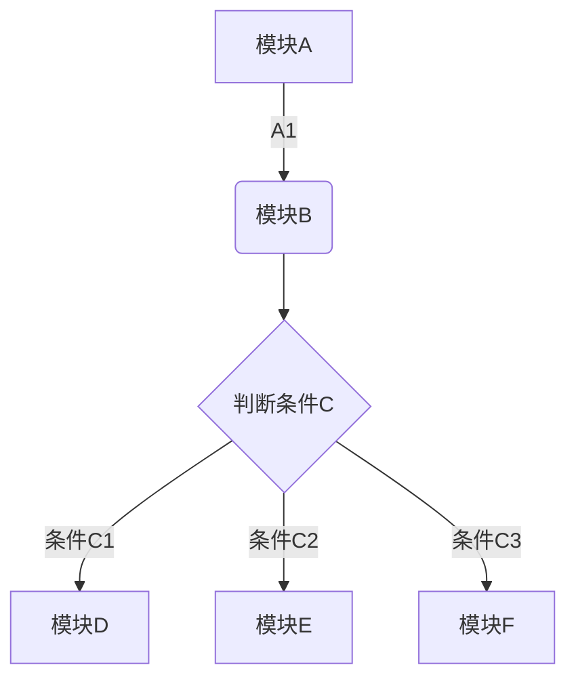
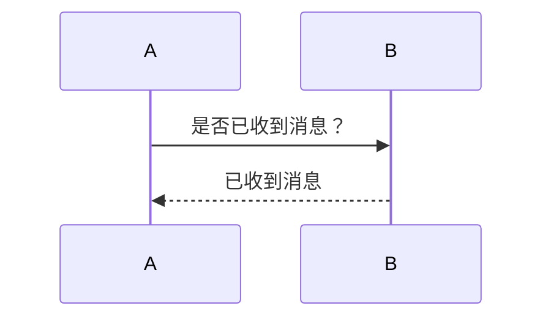
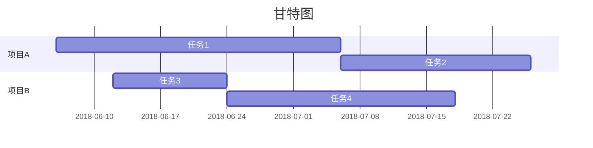

# 物理之美
```math
x=\tan(2x+1)e^{i\pi}+1
```
***
杨振宁说过狄拉克的文章是**秋水文章不染尘**，说海森堡的文章虽然问题很多，但是有*独特的见解*。
每一个物理学家，每一个研究物理的人都有一套自己的<u>独属于自己的特点</u>。
~~物理是枯燥无味的~~根本是无稽之谈。
* * *
>物理是一片大海，我只是在沙滩上捡拾贝壳的孩子。

物理的深邃美丽在于它极大的扩充了我们的思维边界，上到天体宇宙，下至基本粒子，物理无处不在。
1. 物理给人以启迪。
     * 学习物理使人认识世界
2. 物理丰富我们的内心世界
     * 知识是土壤
     
 ***
 今天要做的事
 * [x] 买肥皂
 * [ ] 跑步
 * [ ] 洗衣服
 * * *
 [百度](www.baidu.com)
 ***
 
 ***
 | 帐户类型 | 免费帐户 | 标准帐户 | 高级帐户 | 
| --- | --- | --- | --- | 
| 帐户流量 | 60M | 1GB | 10GB | 
| 设备数目 | 2台 | 无限制 | 无限制 | 
| 当前价格 | 免费 | ￥8.17/月 | ￥12.333333333333/月|
***
```chart
,预算,收入,花费,债务
June,5000,8000,4000,6000 
July,3000,1000,4000,3000 
Aug,5000,7000,6000,3000 
Sep,7000,2000,3000,1000 
Oct,6000,5000,4000,2000 
Nov,4000,3000,5000, 

type: line
title: 每月收益
x.title: Amount 
y.title: Month 
y.suffix: $ 
``` 
***
```html

<!doctype html>
<html>
<head></head>
<body></body>
</html>
```
***

***

***

[toc]
